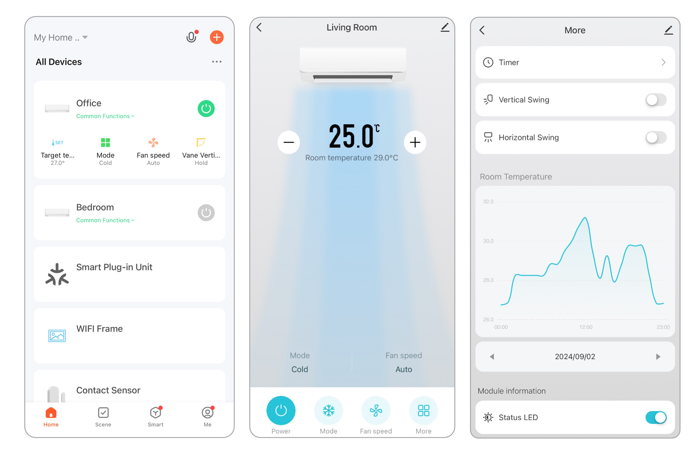

# About WiFiKit-II
WiFiKit-II is a Wi-Fi module for connecting air conditioners to smart home systems. It allows control via mobile apps such as Tuya or Smart Life. It supports air conditioners with an external control interface on the main board, such as Mitsubishi Mr. Slim and Daikin.

## Features
- Main processor: ARM® Cortex®-M0+.
- Connectivity chip: Tuya WBR3 (Wi-Fi 2.4GHz + BLE).
- Communicates with air conditioner via Serial TTL 5V interface.
- Supports 5VDC or  7 - 28V power input.
- Supports OTA (Over-the-Air) firmware updates.
- USB-C port for firmware update and recovery.
- Built-in buzzer for operation notifications (can be disabled).
- LED indicator for operation status (can be disabled).
- Setup/Reset button.

<!--  -->

## Supported Functions
The supported functions may vary depending on the air conditioner model.

### Mitsubishi Mr. Slim

<table class="tg">
<thead>
  <tr>
    <th class="tg"><b>Command<b></th>
    <th class="tg" colspan="2"><b>Operation<b></th>
  </tr>
</thead>
<tbody>
  <tr>
    <td class="tg-0pky" rowspan="10">Basic Commands</td>
    <td class="tg-0pky">Operating Status</td>
    <td class="tg-0pky">On/Off</td>
  </tr>
  <tr>
    <td class="tg-0pky" rowspan="5">Operating Mode</td>
    <td class="tg-0pky">Auto</td>
  </tr>
  <tr>
    <td class="tg-0pky">Cool</td>
  </tr>
  <tr>
    <td class="tg-0pky">Heat*</td>
  </tr>
  <tr>
    <td class="tg-0pky">Dry</td>
  </tr>
    <tr>
    <td class="tg-0pky">Fan Only</td>
  </tr>
  <tr>
    <td class="tg-0pky">Target Temperature Setting</td>
    <td class="tg-0pky">Adjustable in 1°C steps</td>
  </tr>
  <tr>
    <td class="tg-0pky">Fan Speed</td>
    <td class="tg-0pky">Auto, Quiet, 1, 2, 3, 4</td>
  </tr>
  <tr>
    <td class="tg-0pky">Vertical Swing</td>
    <td class="tg-0pky">Auto, Swing, 1, 2, 3, 4, 5</td>
  </tr>
  <tr>
    <td class="tg-0pky">Horizontal Swing*</td>
    <td class="tg-0pky">Swing, &lt;&lt;, &lt;, |, &gt;, &gt;&gt;</td>
  </tr>
  <tr>
    <td class="tg-0pky" rowspan="2">Information Display</td>
    <td class="tg-0pky">Room Temperature</td>
    <td class="tg-0pky">0.5°C resolution</td>
  </tr>
  <tr>
    <td class="tg-0pky">Power Consumption*</td>
    <td class="tg-0pky">Watt</td>
  </tr>
</tbody>
</table>

\**Supported on some air conditioner models*

### Daikin

<table class="tg">
<thead>
  <tr>
    <th class="tg"><b>Command<b></th>
    <th class="tg" colspan="2"><b>Operation<b></th>
  </tr>
</thead>
<tbody>
  <tr>
    <td class="tg-0pky" rowspan="9">Basic Commands</td>
    <td class="tg-0pky">Operating Status</td>
    <td class="tg-0pky">On/Off</td>
  </tr>
  <tr>
    <td class="tg-0pky" rowspan="4">Operating Mode</td>
    <td class="tg-0pky">Cool</td>
  </tr>
  <tr>
    <td class="tg-0pky">Dry</td>
  </tr>
  <tr>
    <td class="tg-0pky">Heat*</td>
  </tr>
  <tr>
    <td class="tg-0pky">Fan Only</td>
  </tr>
  <tr>
    <td class="tg-0pky">Target Temperature Setting</td>
    <td class="tg-0pky">Adjustable in 0.5°C steps</td>
  </tr>
  <tr>
    <td class="tg-0pky">Fan Speed</td>
    <td class="tg-0pky">Auto, 1, 2, 3, 4, 5</td>
  </tr>
  <tr>
    <td class="tg-0pky">Horizontal Swing*</td>
    <td class="tg-0pky">Hold, Swing</td>
  </tr>
    <tr>
    <td class="tg-0pky">Vertical Swing*</td>
    <td class="tg-0pky">Hold, Swing</td>
  </tr>
  <tr>
    <td class="tg-0pky" rowspan="6">Information Display</td>
    <td class="tg-0pky">Room Temperature</td>
    <td class="tg-0pky">0.5°C resolution</td>
  </tr>
  <tr>
    <td class="tg-0pky">Outdoor Temperature*</td>
    <td class="tg-0pky">0.5°C resolution</td>
  </tr>
  <tr>
    <td class="tg-0pky">FCU Coil Temperature</td>
    <td class="tg-0pky">0.5°C resolution</td>
  </tr>
  <tr>
    <td class="tg-0pky">FCU Fan Speed</td>
    <td class="tg-0pky">RPM</td>
  </tr>
  <tr>
    <td class="tg-0pky">Compressor Frequency*</td>
    <td class="tg-0pky">Hz</td>
  </tr>
  <tr>
    <td class="tg-0pky">Electrical Usage*</td>
    <td class="tg-0pky">kWh</td>
  </tr>

</tbody>
</table>

\**Supported on some air conditioner models*

## Example UI for Operation

