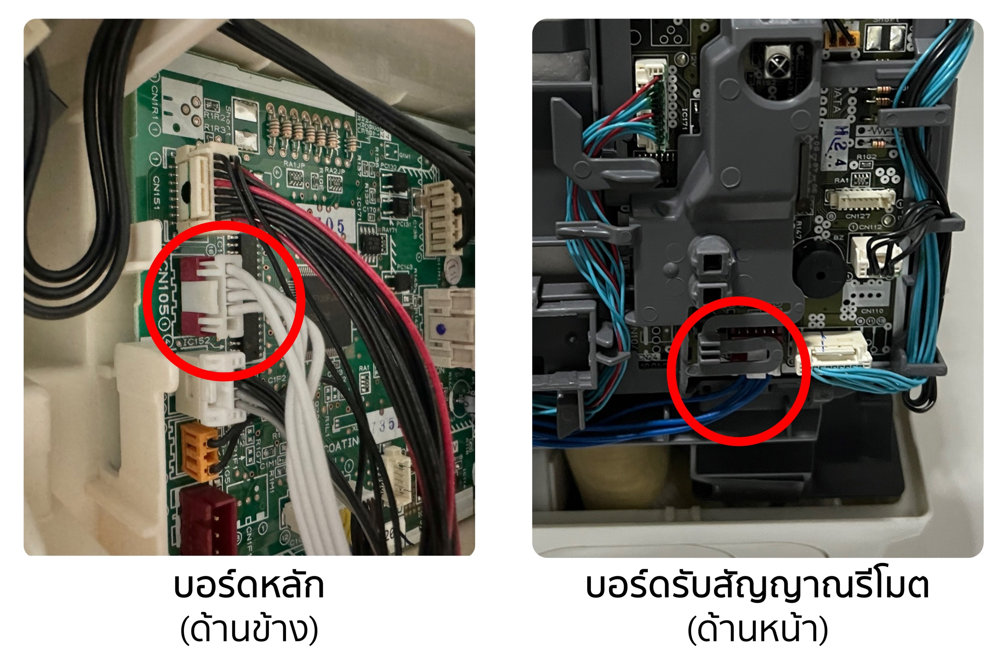
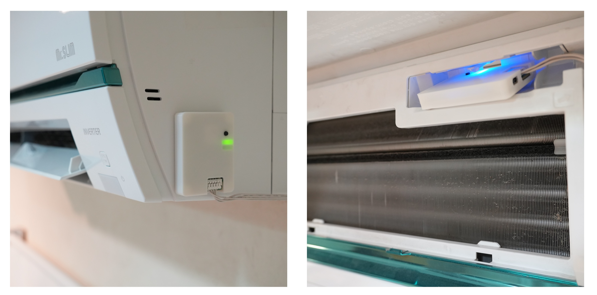

# Installation
> Although the WiFiKit-II supports many air conditioner models, the connection cables may differ. Please check and inform to seller before ordering.

**⚠️Warning⚠️**  Installing the Wi-Fi module requires opening the air conditioner up to the main control board. **You MUST turn off the circuit breaker before installation.** If you are not experienced, there is a risk of electric shock or falling from height. This kit is suitable for those who understand what they are doing. The seller is not responsible for any damages. If you are unsure, it is recommended to hire a professional technician for installation.

## Mitsubishi Electric Mr.SLIM
### Supported Models
Connects to the air conditioner via the `CN105` or labled as `IT` port on the PCB board. **It can be used with all inverter models from 2008 onwards.** Other models such as Fixed Speed (e.g., Econo Air) may also be compatible, but minor modifications to the board are required to install the header and resistor.

**You can check supported models from this** [Google Sheets](https://docs.google.com/spreadsheets/d/103b2I2YXNDqoh_jmmbp_vK3BQh_1u48ZsYAht3kVg7E/edit?usp=sharing)

### Installation
1. **Turn off the circuit breaker**
2. Remove the front cover of the air conditioner
3. Find the `CN105` port (red slot) as shown in the picture. The position of `CN105` may be in the control box (metal box) or on a small board at the front (depending on the model)
4. Plug the connector into the port
5. You can place the module anywhere, but it is recommended not to put it inside the control box as it may reduce Wi-Fi signal strength. Installing it outside will give the best signal.
6. **Turn on the circuit breaker** and check the module status light
7. [Connect to the app](/en-us/setup-tuya.md)

### `CN105` Port Location

### Recommended Installation Location

## Daikin
### Supported Models
The module can replace Daikin Wi-Fi Module models BRPO72C42 and BRPO72C42-1. The compatibility conditions are the same.
- Wall-mounted AC connects via port `S21`*
- Ceiling cassette (SkyAir) connects via ports `X50A` + `X35A`

*Most wall-mounted ACs **require an additional accessory (PC Board) to install the Wi-Fi Module** except for FTKZ and some FTKM series, which can install the module directly without a PC Board.

PC Board part numbers are BRP067A42 and BRP980B42. You can order directly from Daikin or local dealers.

**You can check supported models from:**
- [Daikin Thai](https://www.daikinthai.com/product/dmobile/appmodel-room-air)
- [Google Sheets](https://docs.google.com/spreadsheets/d/1APodIng-e5hc8Ip3vwsKF282vglZvPuGMtBxKGGDL_g/edit?usp=sharing)
  
### Installation
1. **Turn off the circuit breaker**
2. Remove the front cover of the air conditioner
3. For models requiring a PC Board, install the PC Board onto the main board first (follow the manual in the box)
4. Plug the connector into the `S21` or `X50A` + `X35A` ports
5. You can place the module in the designated space inside the AC for the Wi-Fi Module or outside the AC for the best Wi-Fi signal
6. **Turn on the circuit breaker** and check the module status light
7. [Connect to the app](/en-us/setup-tuya.md)
   
#### Wall-mounted Installation Example
- Daikin FTKQ + PC Board  (S403 -> PC Board -> S21)

 

- Daikin FTKZ can be connected directly without a PC Board
  

#### Ceiling Cassette (SkyAir) Installation Example

- Daikin Cassette FBA

### Next Step>[Connect to the app](/en-us/setup-tuya)
