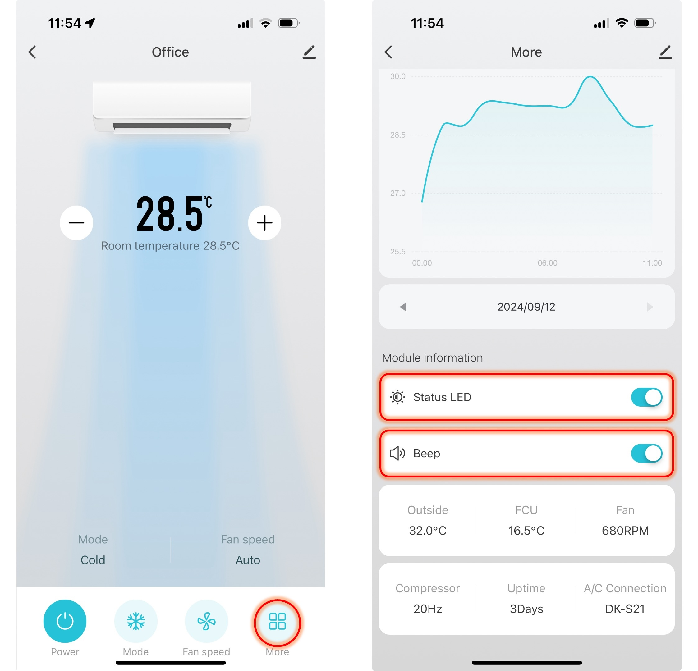

# Module Settings

## Status LED

<table class="tg">
<thead>
  <tr>
    <th class="tg-fymr">Color</th>
    <th class="tg-fymr">Pattern</th>
    <th class="tg-fymr">Meaning</th>
  </tr>
</thead>
<tbody>
  <tr>
    <td class="tg-ncd7" rowspan="3">Green</td>
      <td class="tg-0pky">Solid*</td>
      <td class="tg-0pky">Normal operation</td>
    <tr>
      <td class="tg-0lax">Blinking</td>
      <td class="tg-0pky">Problem connecting to air conditioner</td>
    </tr>
    <tr>
      <td class="tg-0lax">Breathing</td>
      <td class="tg-0pky">Recovery Mode</td>
    </tr>
  </tr>
  <tr>
    <td class="tg-hyan" rowspan="2">Blue</td>
    <td class="tg-0pky">Solid</td>
      <td class="tg-0pky">Operating</td>
    <tr>
      <td class="tg-0lax">Blinking</td>
      <td class="tg-0pky">Connecting to network</td>
    </tr>
  </tr>
</tbody>
</table>

## Control Button

<table class="tg">
<thead>
  <tr>
    <th class="tg-1wig">Button Press Duration (seconds)</th>
    <th class="tg-1wig">Function</th>
  </tr>
</thead>
<tbody>
  <tr>
    <td class="tg-0lax">&lt; 2 seconds</td>
    <td class="tg-0lax">Test command to turn air conditioner on/off</td>
  </tr>
  <tr>
    <td class="tg-0lax">5 - 10</td>
    <td class="tg-0lax">Reset and enter Setup Mode (connect via Bluetooth)</td>
  </tr>
  <tr>
    <td class="tg-0lax">&gt; 10</td>
    <td class="tg-0lax">Reset and enter Setup Mode (connect via Wi-Fi AP)</td>
  </tr>
    <tr>
    <td class="tg-0lax">Hold button during boot</td>
    <td class="tg-0lax">Enter Recovery Mode (USB Update)</td>
  </tr>
</tbody>
</table>

## Turning Buzzer and LED On/Off
This can be done in the app as shown below

