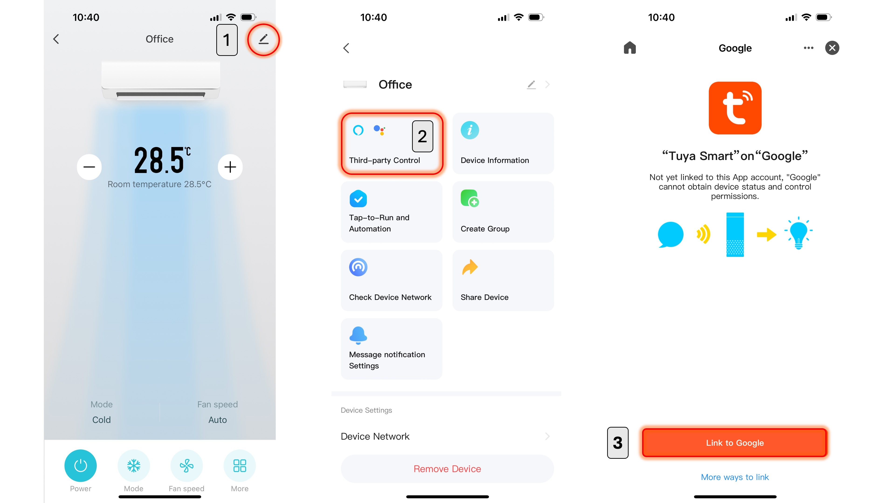

# Connecting to Other Platforms

## Google Home and Amazon Alexa
Supports voice commands for controlling devices, such as turning on the air conditioner, adjusting the temperature, or changing operation modes via Google Nest or Amazon Echo smart speakers.
1. Make sure the Google Home or Amazon Alexa app is already installed on your phone.
2. Go to the device page and tap the menu button `1`.
3. Tap the Third-party Control menu `2`.
4. Select the system you want to connect to (Google Home, Amazon Alexa).
5. Tap Link `3`.
6. Follow the steps in the Google Home or Amazon Alexa app.

## Siri Shortcuts
For voice control via Siri, only pre-configured scenes (Tap-to-Run) in the app can be used. Integration with Apple HomeKit or commands outside of the set scenes are not supported.
1. Create a scene (Tap-to-Run) or configure the air conditioner's operation as desired `1`.
2. Tap Add to Siri at the bottom right button `2`.
3. Select the scene you want to control `3`.
4. Edit the phrase you want to use for the command as needed `4`.
5. Tap Save.

