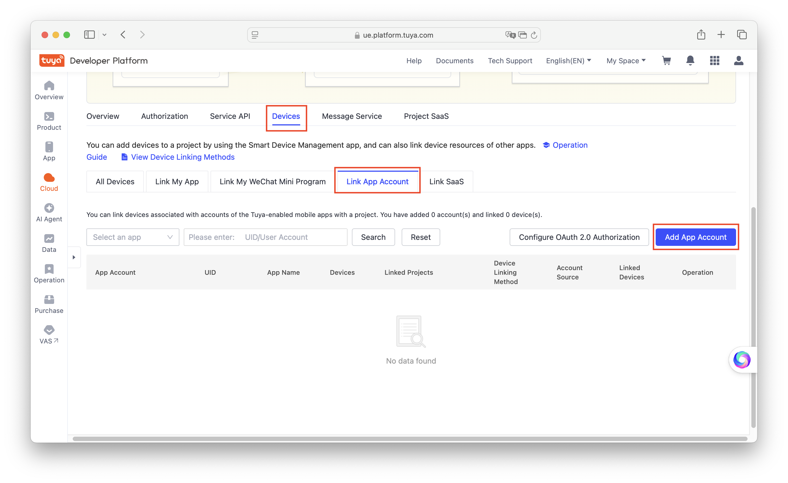
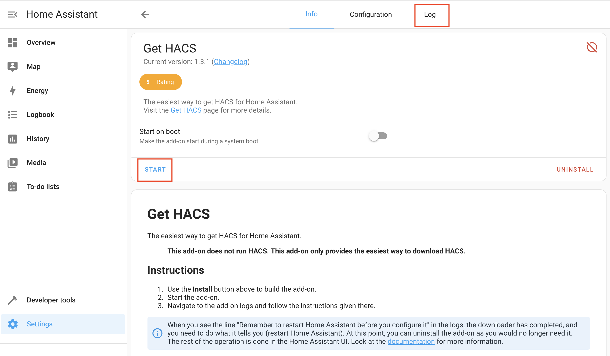

# Adding to Home Assistant

The WiFiKit-II module is designed to work specifically with the Tuya Smart / Smart Life app. If you want to connect it to Home Assistant, there are several ways to do so. This article will guide you through the method using the Local Tuya Integration, which is fast and offers the most complete set of features.

This article is divided into 3 parts:

1. Setting up the Tuya IoT Platform: Obtaining necessary codes and tokens from the Tuya IoT Platform website
2. Installing HACS and Local Tuya
3. Configuring the Local Tuya Integration

### **Prerequisites**

1. Tuya IoT Platform (a different account from the one used to log in to the app) [Register here](https://auth.tuya.com/register?)
2. Github Account [Register here](https://github.com/signup)

 

# Setting up the Tuya IoT Platform

## Create a Project and Link the App

1. Log in to the Tuya IoT Platform
2. In the sidebar, go to `Cloud > Project Management`

3. On the Project Management page, click `Create Cloud Project`
4. Fill in the following information and click Create:
    1. **Project Name**: Any name
    2. **Industry:** Select `Smart Home`
    3. **Development Method:** Select `Smart Home`
    4. **Data Center:** Choose according to your region. For Thailand, select `Western America Data Center` or `Singapore Data Center` (depends on your account).
    

5. In the Configuration Wizard, select the following APIs and click Authorize:
    - IoT Core
    - Industry Basic Service
    - Authorization Token Management
    - Smart Home Basic Service
    - Device Status Notification
    

6. In your project page, go to the `Devices > Link App Account` tab and click `Add App Account`. A QR Code will appear. Scan it with the Tuya Smart or Smart Life app that has your WiFiKit-II device linked, then confirm login.

**If you cannot link, it means the app region does not match the Data Center selected in step 5. Delete the project and create a new one.**

7. In the Link App Account window, select `Automatic Link`. A message will show how many devices have been linked. If it shows 0 Devices, you may have selected the wrong Data Center.

## Finding the Required Token and IDs

You will need 3 values to connect with LocalTuya:

1. `Access ID/Client ID`
2. `Access Secret/Client Secret`
3. `App Account UID`

You can find the `Access ID/Client ID` and `Access Secret/Client Secret` on the Overview page.

The `App Account UID` can be found under `Devices > Link App Account`

# Installing HACS and Integrations

## Installing HACS

HACS (Home Assistant Community Store) is an add-on that makes it easier to install integrations.

The following steps are for Home Assistant OS (Supervised) installations. If you installed using Docker or Core, see the [HACS website](https://www.hacs.xyz/docs/use/download/download/) for instructions.

1. Click [this link](https://my.home-assistant.io/redirect/supervisor_addon/?addon=cb646a50_get&repository_url=https%3A%2F%2Fgithub.com%2Fhacs%2Faddons)
    
    If this is your first time, enter your Home Assistant URL and click Open link.
    
2. A **Missing add-on repository** window will appear. Click **ADD**.
3. Click **INSTALL** (this takes about 5 minutes).
4. Click **START** and go to the Get HACS log page.

5. Wait for the log to show `Installation Complete. Remember to restart Home Assistant before you configure it`. When done, **Restart Home Assistant**.

6. After restarting, go to `Settings > ADD INTEGRATION > HACS`
7. On the **Acknowledgement** page, check all boxes and click **SUBMIT**
8. Connect your Github account as prompted.
9. When finished, HACS will appear in the sidebar.

## Installing Local Tuya

Local Tuya is an unofficial integration for connecting Tuya devices to Home Assistant.

There are several versions of LocalTuya from different developers. **We recommend using [xZetsubou's version](https://github.com/xZetsubou/hass-localtuya)** as it supports more features and is easier to configure than the main version by [rospogrigio](https://github.com/rospogrigio/localtuya).

1. Open the HACS menu from the sidebar.
2. Click the menu button in the top right and select **Custom repositories**
3. Enter the following and click **ADD**, then close the window:
    - Repository: `https://github.com/xZetsubou/hass-localtuya`
    - Type: `Integration`
4. Search for **localtuya**, select the one from **xZetsubou's** repository, and click **DOWNLOAD**. Wait for the download to complete.

5. Go to **Settings**. You will see a HACS/LocalTuya notification. Click **SUBMIT** to restart and wait for the system to restart.

## Installing File Editor

*File Editor is used to upload config files. If you can already access the Home Assistant `config` folder via SMB, you can skip this step.*

Installation steps:

1. Go to `Settings > Add-ons`
2. Click ADD-ON STORE, search for **File Editor**, and click INSTALL.
3. After installation, click **Show in sidebar** to display it, then click START.

# Configuring Local Tuya Integration

1. Download the YAML template file for WiFiKit-II configuration:
    - <a href="../files/WiFiKIT-II-DK.yaml" download> WiFiKIT-II-DK.yaml </a>
    - <a href="../files/WiFiKIT-II-MRSLIM.yaml" download> WiFiKIT-II-MRSLIM.yaml </a>
2. Copy the file to the `custom_components/localtuya/templates/` folder. You can use any method, including the File Editor installed earlier.

3. Go to `Settings > Device & Services > ADD INTEGRATION` and search for Local Tuya.
4. Configure by entering the information obtained from the Tuya IoT Platform:
    - **Data Center Region**: For Thailand, select `Western America Data Center` or `Singapore Data Center` (depends on your account).
    - **Access ID / Client ID**
    - **Access Secret / Client Secret**
    - **App Account UID / User ID**
    

5. Click CONFIGURE, then `Add new device` and select the detected device.
    
6. On the `Configure device connectivity` page, just click SUBMIT.
7. On the `Configure device entities` page, click Use saved template and select the `WiFiKIT-II-XX.yaml` template you added, then click SUBMIT.
8. The template file already maps Tuya functions (DP ID) to Home Assistant entities. **Just keep clicking SUBMIT until the process is complete.** If you want to adjust or exclude any features, you can do so here.
9. The device is now added to Home Assistant.
10. To avoid potential issues, it is recommended to set a fixed IP for your Tuya device.

