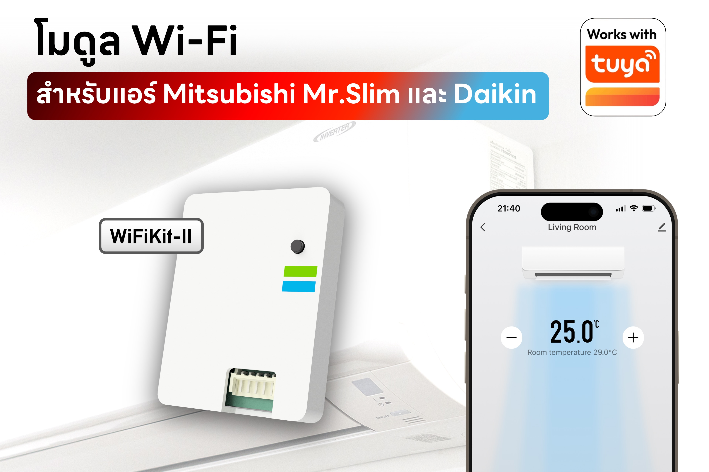
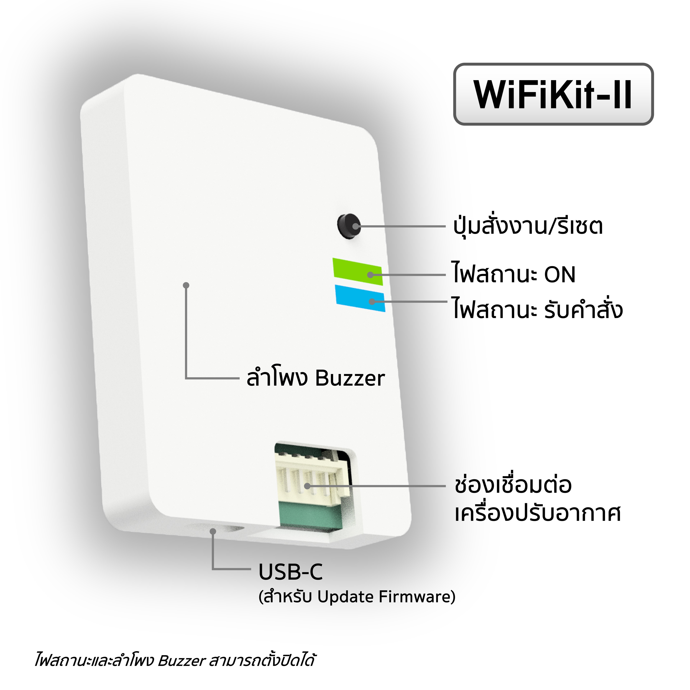
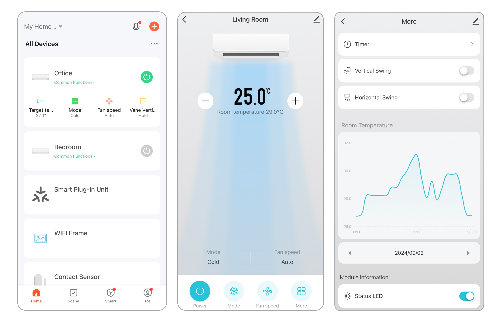

# เกี่ยวกับ WiFiKit-II

> WiFiKit-II คือโมดูล Wi-Fi สำหรับเชื่อมต่อเครื่องปรับอากาศเข้ากับระบบ Smart Home สั่งงานผ่านมือถือผ่านแอป Tuya หรือ Smart Life รองรับเครื่องปรับอากาศที่มี Interface บนบอร์ดสำหรับสั่งงานจากโมดูลภายนอก เช่น Mitsubishi Mr.Slim และ Daikin

## ฟีเจอร์
- ชิปประมวลผลหลัก ARM® Cortex®-M0+
- ชิปการเชื่อมต่อ Tuya WBR3  (Wi-Fi 2.4Ghz + BLE)
- สื่อสารกับเครื่องปรับอากาศผ่านอินเทอร์เฟซ Serial TTL 5V 
- รองรับไฟ DC 5V / 7 - 25V
- รองรับการอัปเดทซอฟท์แวร์แบบ OTA
- พอร์ท USB-C สำหรับ Recovery
- มี Buzzer แจ้งการทำงาน (ปิดได้)
- ไฟ LED แสดงสถานะการทำงาน (ปิดได้)
- ปุ่มสั่งงาน / ปุ่ม Reset

<!--  -->

## ฟังก์ชั่นการทำงานที่รองรับ
ฟังก์ชั่นการทำงานในแต่ละรุ่นอาจจะแตกต่างกัน ขึ้นอยู่กับการรองรับของแอร์รุ่นนั้น ๆ 

### Mitsubishi Mr. Slim

<table class="tg">
<thead>
  <tr>
    <th class="tg"><b>คำสั่ง<b></th>
    <th class="tg" colspan="2"><b>การทำงาน<b></th>
  </tr>
</thead>
<tbody>
  <tr>
    <td class="tg-0pky" rowspan="10">คำสั่งพื้นฐาน</td>
    <td class="tg-0pky">สถานะการทำงาน</td>
    <td class="tg-0pky">เปิด/ปิด</td>
  </tr>
  <tr>
    <td class="tg-0pky" rowspan="5">โหมดการทำงาน</td>
    <td class="tg-0pky">Auto</td>
  </tr>
  <tr>
    <td class="tg-0pky">Cool</td>
  </tr>
  <tr>
    <td class="tg-0pky">Heat*</td>
  </tr>
  <tr>
    <td class="tg-0pky">Dry</td>
  </tr>
    <tr>
    <td class="tg-0pky">Fan Only</td>
  </tr>
  <tr>
    <td class="tg-0pky">การตั้งอุณภภูมิเป้าหมาย</td>
    <td class="tg-0pky">ปรับได้ความละเอียด 1°C Step</td>
  </tr>
  <tr>
    <td class="tg-0pky">ความแรงลม</td>
    <td class="tg-0pky">Auto, Quiet, 1, 2, 3, 4</td>
  </tr>
  <tr>
    <td class="tg-0pky">การส่ายแนวตั้ง</td>
    <td class="tg-0pky">Auto, Swing, 1, 2, 3, 4, 5</td>
  </tr>
  <tr>
    <td class="tg-0pky">การส่ายแนวนอน*</td>
    <td class="tg-0pky">Swing, &lt;&lt;, &lt;, |, &gt;, &gt;&gt;</td>
  </tr>
  <tr>
    <td class="tg-0pky" rowspan="2">การดูข้อมูล</td>
    <td class="tg-0pky">อุณหภูมิห้อง</td>
    <td class="tg-0pky">ความละเอียด 0.5°C </td>
  </tr>
  <tr>
    <td class="tg-0pky">การใช้พลังงาน*</td>
    <td class="tg-0pky">วัตต์</td>
  </tr>
</tbody>
</table>

\**รองรับกับเครื่องปรับอากาศบางรุ่น*

### Daikin

<table class="tg">
<thead>
  <tr>
    <th class="tg"><b>คำสั่ง<b></th>
    <th class="tg" colspan="2"><b>การทำงาน<b></th>
  </tr>
</thead>
<tbody>
  <tr>
    <td class="tg-0pky" rowspan="9">คำสั่งพื้นฐาน</td>
    <td class="tg-0pky">สถานะการทำงาน</td>
    <td class="tg-0pky">เปิด/ปิด</td>
  </tr>
  <tr>
    <td class="tg-0pky" rowspan="4">โหมดการทำงาน</td>
    <td class="tg-0pky">Cool</td>
  </tr>
  <tr>
    <td class="tg-0pky">Dry</td>
  </tr>
  <tr>
    <td class="tg-0pky">Heat*</td>
  </tr>
  <tr>
    <td class="tg-0pky">Fan Only</td>
  </tr>
  <tr>
    <td class="tg-0pky">การตั้งอุณภภูมิเป้าหมาย</td>
    <td class="tg-0pky">ปรับได้ความละเอียด 0.5°C</td>
  </tr>
  <tr>
    <td class="tg-0pky">ความแรงพัดลม</td>
    <td class="tg-0pky">Auto, 1, 2, 3, 4, 5</td>
  </tr>
  <tr>
    <td class="tg-0pky">การส่ายแนวนอน*</td>
    <td class="tg-0pky">Hold, Swing</td>
  </tr>
    <tr>
    <td class="tg-0pky">การส่ายแนวตั้ง*</td>
    <td class="tg-0pky">Hold, Swing</td>
  </tr>
  <tr>
    <td class="tg-0pky" rowspan="6">การดูข้อมูล</td>
    <td class="tg-0pky">อุณหภูมิห้อง</td>
    <td class="tg-0pky">ความละเอียด 0.5°C</td>
  </tr>
  <tr>
    <td class="tg-0pky">อุณหภูมิภายนอก*</td>
    <td class="tg-0pky">ความละเอียด 0.5°C</td>
  </tr>
  <tr>
    <td class="tg-0pky">อุณหภูมิคอยล์เย็น</td>
    <td class="tg-0pky">ความละเอียด 0.5°C</td>
  </tr>
  <tr>
    <td class="tg-0pky">ความเร็วพัดลมคอยล์เย็น</td>
    <td class="tg-0pky">รอบ/นาที</td>
  </tr>
  <tr>
    <td class="tg-0pky">ความถี่คอมเพรซเซอร์*</td>
    <td class="tg-0pky">Hz</td>
  </tr>
    <tr>
    <td class="tg-0pky">การใช้พลังงาน*</td>
    <td class="tg-0pky">หน่วย</td>
  </tr>
</tbody>
</table>

\**รองรับกับเครื่องปรับอากาศบางรุ่น*

## ตัวอย่าง UI ในการสั่งงาน

