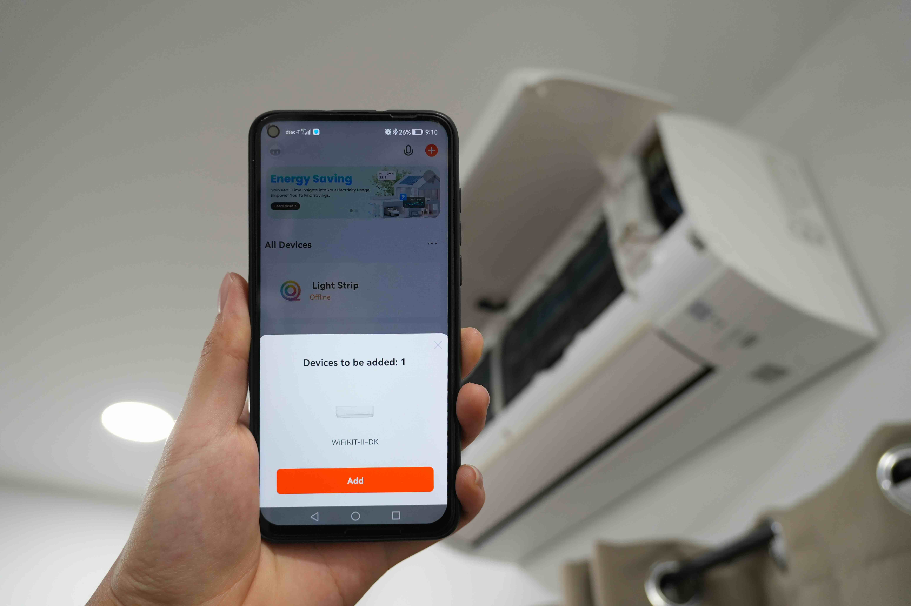

# การเพิ่มเข้าแอปพลิเคชัน
ตัว WiFiKit-II เชื่อมต่อกับแอปผ่านสัญญาณ Wi-Fi ดังนั้นแล้วบริเวณที่ทำการติดตั้งต้องมีสัญญาณ Wi-Fi และอินเทอร์เน็ต

<!-- ## วิดีโอการติดตั้ง
<iframe width="560" height="315" src="https://www.youtube.com/embed/uPHk5j-ZJIM?si=KHFE2BC38sMSddzB" title="YouTube video player" frameborder="0" allow="accelerometer; autoplay; clipboard-write; encrypted-media; gyroscope; picture-in-picture; web-share" referrerpolicy="strict-origin-when-cross-origin" allowfullscreen></iframe> -->

1. **ติดตั้งแอปพลิเคชัน**   สามารถใช้ได้ทั้งแอป Tuya Smart หรือ Smart Life บนระบบ iOS และ Android 
[สามารถดาวน์โหลดได้จากที่นี่](https://smartapp.tuya.com/tuyasmart)

2. **เชื่อมต่อโมดูลเข้ากับแอป**
- เชื่อมต่อ Wi-Fi และเปิด Bluetooth บนโทรศัพท์มิอถิอ
- ตรวจสอบว่าโมดูลอยู่ในสถานะพร้อมเชื่อมต่อ (ไฟสีน้ำเงินกระพริบ) หากไม่ใช่ ให้กดปุ่ม setup ค้างไว้ 6 วินาที
- เข้าแอป และรอให้ตัวอุปกรณ์ WiFiKit-II pop-up ขึ้นมา (หากไม่ขึ้นให้กดปุ่ม `+` ที่มุมบนขวา)
- กดเชื่อมต่อและใส่รหัสของ Wi-Fi
- ทำตามขั้นตอนในแอป

